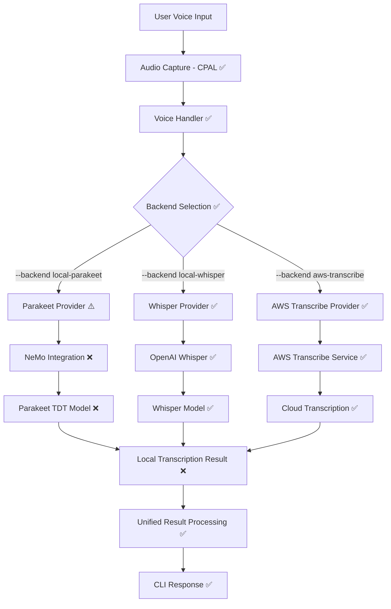

# Design Document

## Overview

This design completes the local voice-to-text capabilities using NVIDIA's Parakeet TDT 0.6B V2 model as an alternative to AWS Transcribe. The Amazon Q CLI already has a comprehensive voice infrastructure with support for multiple transcription backends including AWS Transcribe, Local Whisper, and a placeholder for Local Parakeet.

**Current State Analysis:**
- ✅ Complete voice infrastructure with `TranscriptionProvider` trait
- ✅ Audio capture system using CPAL
- ✅ Voice Activity Detection (VAD) 
- ✅ Backend selection via CLI arguments (`--backend local-parakeet`)
- ✅ Whisper provider fully implemented as reference
- ⚠️ Parakeet provider exists but returns "not yet implemented" error
- ✅ Common utilities for Python integration, model management, and audio processing

**What Needs to Be Built:**
The primary task is completing the `ParakeetProvider` implementation by replacing the placeholder with actual NeMo/Parakeet TDT integration, following the established patterns from the WhisperProvider.

## Architecture

### Current Architecture (Already Implemented)



**Legend:** ✅ Implemented | ⚠️ Placeholder | ❌ Missing

### Component Architecture

The implementation completes the existing voice architecture by implementing the missing Parakeet components:

**Existing Infrastructure (Reuse):**
1. ✅ **TranscriptionProvider Trait**: Well-defined interface for all backends
2. ✅ **Audio Capture System**: CPAL-based microphone input with VAD
3. ✅ **Voice Handler**: Manages transcription lifecycle and user interaction
4. ✅ **Common Utilities**: Python detection, dependency checking, model caching
5. ✅ **CLI Integration**: Backend selection via `--backend local-parakeet`

**New Components (To Implement):**
1. **Complete Parakeet Provider**: Replace placeholder with NeMo integration
2. **NeMo Python Scripts**: Parakeet-specific transcription scripts
3. **Model Management**: Parakeet TDT model download and caching
4. **Audio Format Handling**: Ensure 16kHz mono compatibility

## Components and Interfaces

### 1. Complete Parakeet Provider Implementation

The existing `ParakeetProvider` struct needs to be completed following the `WhisperProvider` pattern:

```rust
pub struct ParakeetProvider {
    vad_threshold_db: f64,
    python_executable: PathBuf,
}
```

**Key Methods (Following WhisperProvider Pattern):**
- `new(language: &str) -> Result<Self>` - Initialize with dependency checks
- `start_transcription() -> Result<TranscriptionResult>` - Main transcription loop
- `check_dependencies() -> Result<()>` - Verify NeMo installation
- `preload_model() -> Result<()>` - Download and cache Parakeet TDT model
- `transcribe_with_parakeet(wav_path, python_executable, language) -> Result<String>` - Core transcription

### 2. NeMo Integration Scripts

Following the Whisper pattern, create Python scripts for Parakeet TDT integration:

**Dependency Check Script:**
```python
# Check for: nemo_toolkit[asr], torch, librosa, soundfile
packages = ["nemo_toolkit", "torch", "librosa", "soundfile"]
```

**Model Preload Script:**
```python
import nemo.collections.asr as nemo_asr
model = nemo_asr.models.ASRModel.from_pretrained("nvidia/parakeet-tdt-0.6b-v2")
```

**Transcription Script:**
```python
# Load model and transcribe with timestamps
output = model.transcribe([wav_path], timestamps=True)
```

**Model Management:**
- Leverage existing `is_model_cached()` function for HuggingFace cache detection
- Use NeMo's automatic model download from HuggingFace Hub
- No manual model management needed (NeMo handles this)

### 3. Audio Processing Integration

Reuse existing audio processing infrastructure:

**Existing Components:**
- ✅ `detect_voice_activity()` - VAD using RMS analysis
- ✅ `create_wav_file()` - Convert raw audio to WAV format
- ✅ `detect_python_executable()` - Find suitable Python installation
- ✅ `check_python_dependencies()` - Verify package installation

**Parakeet-Specific Requirements:**
- Ensure 16kHz sample rate (already handled by existing audio capture)
- Mono channel audio (already configured)
- WAV format compatibility (existing `create_wav_file()` function)
- Voice Activity Detection with configurable threshold (already implemented)

### 4. Backend Selection (Already Implemented)

The CLI already supports Parakeet backend selection:

```bash
# Use Parakeet TDT for local transcription
q chat /voice --backend local-parakeet

# Use Whisper for local transcription  
q chat /voice --backend local-whisper

# Use AWS Transcribe (default)
q chat /voice --backend aws-transcribe
```

**Existing Configuration:**
- ✅ `TranscriptionBackend::LocalParakeet` enum variant
- ✅ CLI argument parsing with `--backend local-parakeet`
- ✅ Backend routing in `VoiceHandler::new()`
- ✅ Error handling and fallback to text input

### 5. Transcription Loop Pattern (Reuse Existing)

The Parakeet implementation will follow the exact same pattern as WhisperProvider:

**Existing Pattern:**
1. ✅ Audio buffer accumulation with VAD
2. ✅ Periodic processing (every 2 seconds)
3. ✅ Session timeout handling (5s silence, 30s max)
4. ✅ Real-time transcript updates
5. ✅ Final processing of remaining audio
6. ✅ Error handling and cleanup

**Parakeet Adaptations:**
- Replace Whisper Python scripts with NeMo/Parakeet scripts
- Adjust processing timeouts for Parakeet performance characteristics
- Maintain same audio buffer and VAD logic

## Data Models

### Transcription Results

```rust
pub struct EnhancedTranscriptionResult {
    pub text: String,
    pub confidence: f32,
    pub word_timestamps: Option<Vec<WordTimestamp>>,
    pub segment_timestamps: Option<Vec<SegmentTimestamp>>,
    pub processing_metadata: ProcessingMetadata,
}

pub struct WordTimestamp {
    pub word: String,
    pub start_time: f32,
    pub end_time: f32,
    pub confidence: f32,
}

pub struct ProcessingMetadata {
    pub backend_used: TranscriptionBackend,
    pub processing_time: Duration,
    pub model_version: Option<String>,
    pub audio_duration: Duration,
}
```

### Model Management

```rust
pub struct ModelStatus {
    pub is_available: bool,
    pub version: String,
    pub last_updated: SystemTime,
    pub size_on_disk: u64,
    pub health_status: ModelHealth,
}

pub enum ModelHealth {
    Healthy,
    Corrupted,
    Missing,
    OutdatedVersion,
}
```

## Error Handling

### Enhanced Error Types

```rust
#[derive(Debug, Error)]
pub enum VoiceError {
    // Existing errors...
    
    #[error("Local model not available: {0}")]
    LocalModelUnavailable(String),
    
    #[error("Model download failed: {0}")]
    ModelDownloadFailed(String),
    
    #[error("Python environment error: {0}")]
    PythonEnvironmentError(String),
    
    #[error("Model inference timeout")]
    InferenceTimeout,
    
    #[error("Insufficient system resources: {0}")]
    InsufficientResources(String),
    
    #[error("Model corruption detected")]
    ModelCorruption,
}
```

### Fallback Strategy

1. **Primary**: Attempt local processing with Parakeet
2. **Secondary**: Fall back to AWS Transcribe on local failure
3. **Error Handling**: Provide clear user feedback on fallback reasons
4. **Recovery**: Attempt to fix local issues (re-download, restart Python env)

## Testing Strategy

### Unit Tests

1. **Model Manager Tests**
   - Model download and verification
   - Checksum validation
   - Version management
   - Disk space handling

2. **Python Bridge Tests**
   - Environment setup and validation
   - Audio format conversion
   - Model loading and inference
   - Error handling and timeouts

3. **Parakeet Provider Tests**
   - Transcription accuracy with test audio
   - Timestamp generation
   - Performance benchmarks
   - Fallback behavior

### Integration Tests

1. **End-to-End Voice Processing**
   - Complete voice-to-text pipeline
   - Backend switching functionality
   - Configuration management
   - Error recovery scenarios

2. **Performance Tests**
   - Processing time benchmarks
   - Memory usage monitoring
   - Concurrent request handling
   - Long audio processing (up to 24 minutes)

### Acceptance Tests

1. **User Experience Tests**
   - Voice command accuracy
   - Response time validation
   - Offline functionality
   - Configuration ease-of-use

2. **Compatibility Tests**
   - Different audio formats (.wav, .flac)
   - Various microphone types
   - Different system configurations
   - Cross-platform functionality (macOS, Linux, Windows)

## Implementation Approach

### Single Phase Implementation

Since the infrastructure is already complete, this is a focused implementation:

**Step 1: Replace Placeholder Implementation**
- Remove the "not yet implemented" error from `ParakeetProvider`
- Implement the same structure as `WhisperProvider`

**Step 2: Create NeMo Python Scripts**
- Dependency check script for NeMo toolkit
- Model preload script for Parakeet TDT
- Transcription script with timestamp support

**Step 3: Integrate Audio Processing**
- Reuse existing VAD and audio buffer logic
- Adapt timeout values for Parakeet performance
- Maintain same user experience as Whisper

**Step 4: Testing and Validation**
- Test with various audio inputs
- Verify model download and caching
- Ensure error handling works correctly

## Dependencies

### Rust Dependencies (No Changes Needed)

All required dependencies are already in the workspace:
- ✅ `tokio` - Async runtime
- ✅ `eyre` - Error handling  
- ✅ `tempfile` - Temporary WAV files
- ✅ `which` - Python executable detection

### Python Dependencies (New)

```python
# Core NeMo framework for Parakeet TDT
nemo_toolkit[asr] >= 2.2.0

# Audio processing (may already be installed with NeMo)
librosa >= 0.10.0
soundfile >= 0.12.0
torch >= 2.0.0
```

### System Requirements

Following the Parakeet TDT model specifications:
- **Memory**: Minimum 2GB RAM for model loading
- **Storage**: ~3GB for model and dependencies
- **Python**: Python 3.8+ (detected automatically)
- **GPU**: Optional CUDA support for acceleration
- **Audio**: 16kHz mono input (handled by existing audio capture)

## Security Considerations

1. **Model Integrity**: Verify model checksums to prevent tampering
2. **Python Environment**: Isolate Python dependencies to prevent conflicts
3. **Audio Data**: Ensure local audio processing doesn't leak data
4. **File Permissions**: Secure model cache directory access
5. **Network Security**: Use HTTPS for model downloads with certificate validation

## Performance Considerations

1. **Model Loading**: Cache loaded model in memory to avoid reload overhead
2. **Audio Processing**: Use streaming processing for long audio files
3. **Memory Management**: Monitor and limit memory usage during inference
4. **Concurrent Processing**: Handle multiple requests efficiently
5. **Resource Monitoring**: Track CPU/GPU usage and adjust processing accordingly

## Key Design Decisions

### 1. Reuse Existing Infrastructure
Rather than building new components, we leverage the comprehensive voice infrastructure already in place. This ensures consistency and reduces implementation complexity.

### 2. Follow WhisperProvider Pattern
The `WhisperProvider` serves as a perfect template for local transcription. By following its exact structure, we ensure the Parakeet implementation integrates seamlessly.

### 3. NeMo Automatic Model Management
Instead of building custom model download logic, we rely on NeMo's built-in HuggingFace integration for automatic model downloading and caching.

### 4. Maintain User Experience Consistency
Users will have the same experience with Parakeet as with Whisper - same commands, same UI, same error handling, just different underlying model.

### 5. Minimal Code Changes
The implementation requires changes only to `parakeet_provider.rs` and creation of Python scripts. No changes to CLI, audio capture, or other components.

This design ensures seamless integration with existing voice infrastructure while providing robust local processing capabilities that meet the performance and accuracy requirements specified in the requirements document.