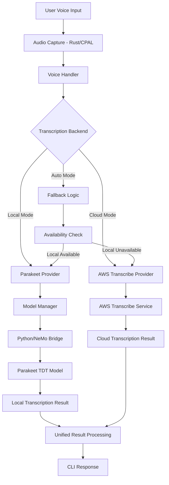

# Design Document

## Overview

This design implements local voice-to-text capabilities using NVIDIA's Parakeet TDT 0.6B V2 model as an alternative to AWS Transcribe. The solution integrates with the existing voice infrastructure in the Amazon Q CLI while adding local processing capabilities for offline usage and enhanced privacy.

The design leverages the existing `TranscriptionProvider` trait architecture, allowing seamless switching between cloud and local processing modes. The implementation will use Python bindings to interface with the NeMo toolkit for model execution, while maintaining the Rust-based audio capture and processing pipeline.

## Architecture

### High-Level Architecture



### Component Architecture

The implementation extends the existing voice architecture with these key components:

1. **Enhanced Parakeet Provider**: Complete implementation of the `TranscriptionProvider` trait
2. **Model Manager**: Handles model downloading, caching, and lifecycle management
3. **Python Bridge**: Rust-Python interop for NeMo toolkit integration
4. **Configuration Manager**: Manages local vs cloud preferences and fallback logic
5. **Performance Monitor**: Tracks processing times and resource usage

## Components and Interfaces

### 1. Enhanced Parakeet Provider

```rust
pub struct ParakeetProvider {
    model_manager: Arc<ModelManager>,
    python_bridge: Arc<PythonBridge>,
    config: ParakeetConfig,
}

pub struct ParakeetConfig {
    pub model_path: PathBuf,
    pub language: String,
    pub enable_timestamps: bool,
    pub max_audio_length: Duration,
    pub processing_timeout: Duration,
}
```

**Key Methods:**
- `new(language: &str, config: ParakeetConfig) -> Result<Self>`
- `start_transcription() -> Result<TranscriptionResult>`
- `check_availability() -> bool`
- `get_model_info() -> ModelInfo`

### 2. Model Manager

```rust
pub struct ModelManager {
    model_cache_dir: PathBuf,
    download_client: reqwest::Client,
    model_info: ModelInfo,
}

pub struct ModelInfo {
    pub version: String,
    pub size_bytes: u64,
    pub checksum: String,
    pub download_url: String,
}
```

**Responsibilities:**
- Download Parakeet TDT model from HuggingFace
- Verify model integrity using checksums
- Manage model versioning and updates
- Handle disk space requirements (2GB+ for model)
- Provide model availability status

### 3. Python Bridge

```rust
pub struct PythonBridge {
    python_path: PathBuf,
    nemo_env_path: Option<PathBuf>,
    model_instance: Option<PyObject>,
}

pub struct TranscriptionRequest {
    pub audio_data: Vec<f32>,
    pub sample_rate: u32,
    pub enable_timestamps: bool,
}

pub struct TranscriptionResponse {
    pub text: String,
    pub confidence: f32,
    pub word_timestamps: Option<Vec<WordTimestamp>>,
    pub processing_time: Duration,
}
```

**Key Features:**
- Manages Python environment and NeMo dependencies
- Handles audio format conversion (16kHz mono)
- Provides async interface for model inference
- Manages model loading and memory usage
- Implements timeout and error handling

### 4. Configuration Manager

```rust
pub struct VoiceConfig {
    pub backend: TranscriptionBackend,
    pub fallback_enabled: bool,
    pub local_model_path: Option<PathBuf>,
    pub performance_monitoring: bool,
}

#[derive(Debug, Clone)]
pub enum TranscriptionBackend {
    AwsTranscribe,
    LocalParakeet,
    AutoFallback, // New option
}
```

**Configuration Options:**
- Backend selection (AWS, Local, Auto)
- Model download preferences
- Performance monitoring settings
- Fallback behavior configuration
- Language preferences

### 5. Audio Processing Pipeline

The existing audio capture system will be enhanced to support local processing requirements:

```rust
pub struct AudioProcessor {
    pub sample_rate: u32, // Fixed at 16kHz for Parakeet
    pub channels: u16,    // Mono channel
    pub format: AudioFormat,
}
```

**Enhancements:**
- Ensure 16kHz sample rate for Parakeet compatibility
- Add audio format validation
- Implement audio segmentation for long recordings (24-minute max)
- Add voice activity detection for better processing

## Data Models

### Transcription Results

```rust
pub struct EnhancedTranscriptionResult {
    pub text: String,
    pub confidence: f32,
    pub word_timestamps: Option<Vec<WordTimestamp>>,
    pub segment_timestamps: Option<Vec<SegmentTimestamp>>,
    pub processing_metadata: ProcessingMetadata,
}

pub struct WordTimestamp {
    pub word: String,
    pub start_time: f32,
    pub end_time: f32,
    pub confidence: f32,
}

pub struct ProcessingMetadata {
    pub backend_used: TranscriptionBackend,
    pub processing_time: Duration,
    pub model_version: Option<String>,
    pub audio_duration: Duration,
}
```

### Model Management

```rust
pub struct ModelStatus {
    pub is_available: bool,
    pub version: String,
    pub last_updated: SystemTime,
    pub size_on_disk: u64,
    pub health_status: ModelHealth,
}

pub enum ModelHealth {
    Healthy,
    Corrupted,
    Missing,
    OutdatedVersion,
}
```

## Error Handling

### Enhanced Error Types

```rust
#[derive(Debug, Error)]
pub enum VoiceError {
    // Existing errors...
    
    #[error("Local model not available: {0}")]
    LocalModelUnavailable(String),
    
    #[error("Model download failed: {0}")]
    ModelDownloadFailed(String),
    
    #[error("Python environment error: {0}")]
    PythonEnvironmentError(String),
    
    #[error("Model inference timeout")]
    InferenceTimeout,
    
    #[error("Insufficient system resources: {0}")]
    InsufficientResources(String),
    
    #[error("Model corruption detected")]
    ModelCorruption,
}
```

### Fallback Strategy

1. **Primary**: Attempt local processing with Parakeet
2. **Secondary**: Fall back to AWS Transcribe on local failure
3. **Error Handling**: Provide clear user feedback on fallback reasons
4. **Recovery**: Attempt to fix local issues (re-download, restart Python env)

## Testing Strategy

### Unit Tests

1. **Model Manager Tests**
   - Model download and verification
   - Checksum validation
   - Version management
   - Disk space handling

2. **Python Bridge Tests**
   - Environment setup and validation
   - Audio format conversion
   - Model loading and inference
   - Error handling and timeouts

3. **Parakeet Provider Tests**
   - Transcription accuracy with test audio
   - Timestamp generation
   - Performance benchmarks
   - Fallback behavior

### Integration Tests

1. **End-to-End Voice Processing**
   - Complete voice-to-text pipeline
   - Backend switching functionality
   - Configuration management
   - Error recovery scenarios

2. **Performance Tests**
   - Processing time benchmarks
   - Memory usage monitoring
   - Concurrent request handling
   - Long audio processing (up to 24 minutes)

### Acceptance Tests

1. **User Experience Tests**
   - Voice command accuracy
   - Response time validation
   - Offline functionality
   - Configuration ease-of-use

2. **Compatibility Tests**
   - Different audio formats (.wav, .flac)
   - Various microphone types
   - Different system configurations
   - Cross-platform functionality (macOS, Linux, Windows)

## Implementation Phases

### Phase 1: Core Infrastructure
- Model Manager implementation
- Python Bridge development
- Basic Parakeet Provider structure
- Configuration management

### Phase 2: Model Integration
- NeMo toolkit integration
- Audio processing pipeline
- Transcription functionality
- Basic error handling

### Phase 3: Advanced Features
- Timestamp support
- Performance optimization
- Fallback mechanisms
- Configuration UI

### Phase 4: Production Readiness
- Comprehensive testing
- Documentation
- Performance tuning
- User experience polish

## Dependencies

### New Rust Dependencies

```toml
# Python integration
pyo3 = { version = "0.20", features = ["auto-initialize"] }
pyo3-asyncio = "0.20"

# Model management
sha2 = "0.10" # Already in workspace
reqwest = { version = "0.12", features = ["stream"] } # Already in workspace

# Audio processing enhancements
hound = "3.5" # WAV file handling
```

### Python Dependencies

```python
# Core ML framework
nemo_toolkit[asr] >= 2.2.0

# Audio processing
librosa >= 0.10.0
soundfile >= 0.12.0

# Utilities
numpy >= 1.24.0
torch >= 2.0.0
```

### System Requirements

- **Memory**: Minimum 4GB RAM (2GB for model + 2GB for system)
- **Storage**: 3GB free space (model + dependencies)
- **Python**: Python 3.8+ with pip
- **GPU**: Optional but recommended (CUDA-compatible for acceleration)

## Security Considerations

1. **Model Integrity**: Verify model checksums to prevent tampering
2. **Python Environment**: Isolate Python dependencies to prevent conflicts
3. **Audio Data**: Ensure local audio processing doesn't leak data
4. **File Permissions**: Secure model cache directory access
5. **Network Security**: Use HTTPS for model downloads with certificate validation

## Performance Considerations

1. **Model Loading**: Cache loaded model in memory to avoid reload overhead
2. **Audio Processing**: Use streaming processing for long audio files
3. **Memory Management**: Monitor and limit memory usage during inference
4. **Concurrent Processing**: Handle multiple requests efficiently
5. **Resource Monitoring**: Track CPU/GPU usage and adjust processing accordingly

The design ensures seamless integration with existing voice infrastructure while providing robust local processing capabilities that meet the performance and accuracy requirements specified in the requirements document.